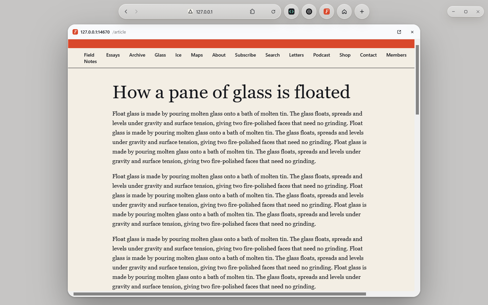
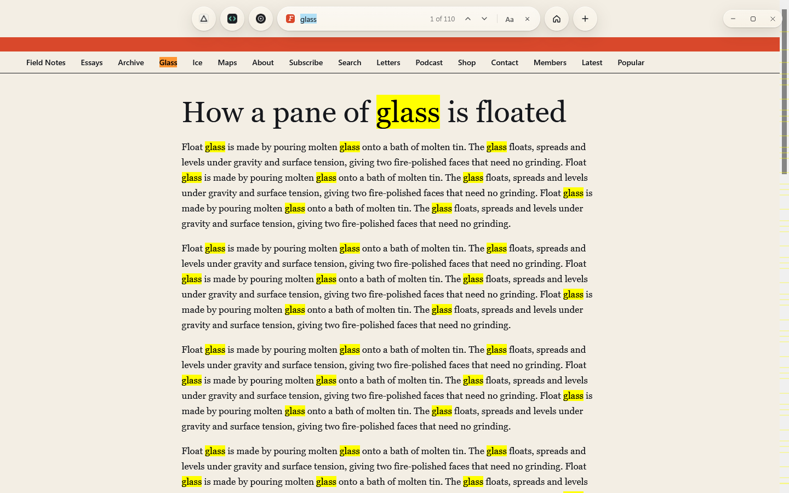
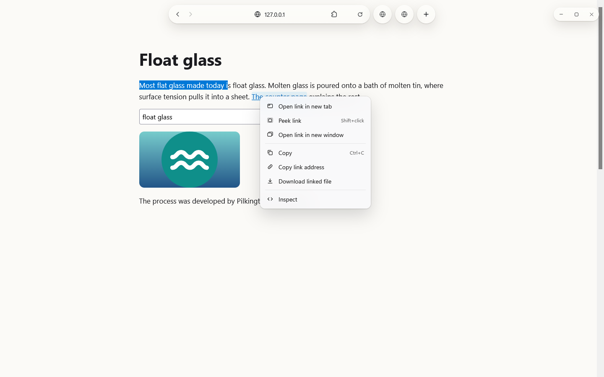
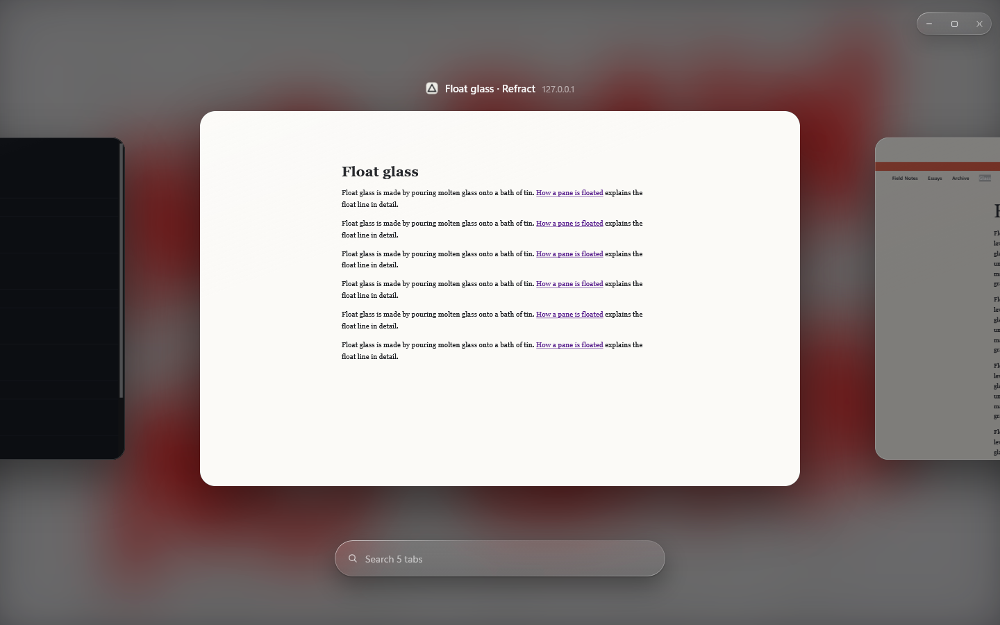
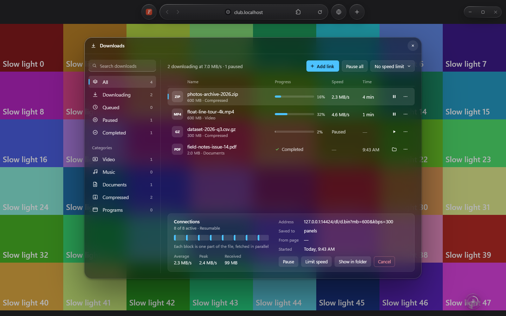
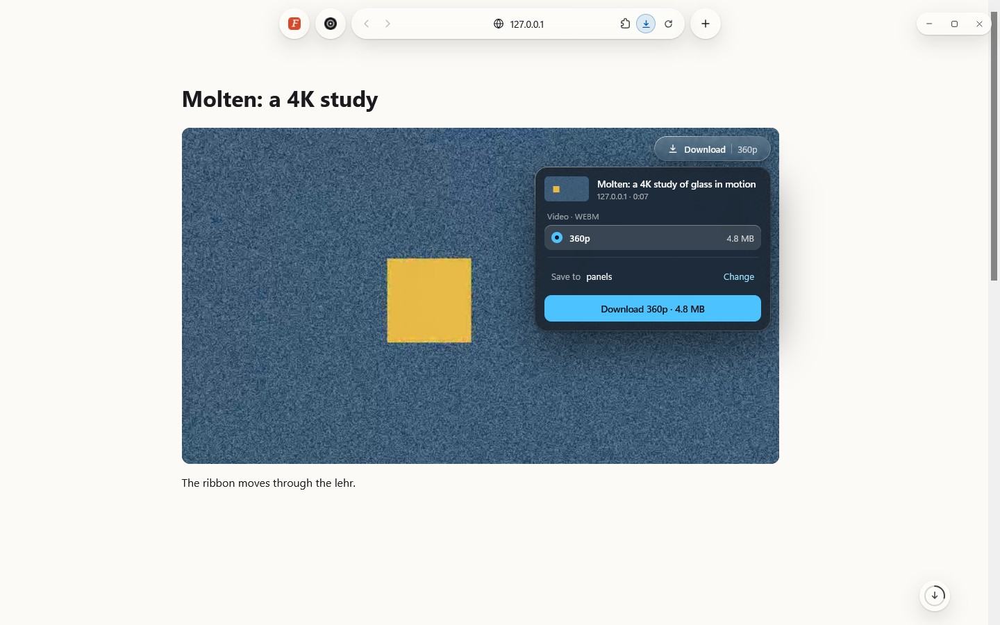

# Deer

Deer is a web browser for Windows with a liquid-glass interface. Like Zen, it is built on
Firefox's engine, Gecko. The engine does the browsing (pages, tabs, history, session restore,
networking, add-ons), and Deer replaces Firefox's interface with its own, drawn by a privileged
layer inside the browser window. Firefox add-ons run on the engine's own add-on support, including
the request-blocking API that content blockers such as uBlock Origin use.

Deer is in early development. It is made for 64-bit Windows and is developed and tested on
Windows 11.



## Features

- **Glass tab bar.** One bar at the top centre. The active tab is a pill that is also the address
  and search field; the other tabs are favicon circles. The glass refracts the page under it. The
  bar can hide itself while you read, and pages start below it so it never covers their top.
- **Home page** with the Windows wallpaper, a picture of your own or a video behind it.
- **Peek.** Shift+click a link, or press Ctrl+Q on it, to open it in a sheet over the current page.
  Alt+Enter turns the sheet into a tab without loading the page again.
- **Find in page.** Ctrl+F turns the address pill into a find field with a match counter.
- **Tab switcher.** Hold Ctrl and press Tab for a deck of large tab cards; a grid and a strip are
  the alternatives. Ctrl+Shift+A searches the open tabs.
- **Menus.** Deer's own right-click menus for pages, links, images, selections, text fields and
  the tab bar, with keyboard access keys.
- **Downloads.** A download manager (Ctrl+J) that fetches a file over several parallel
  connections (8 by default, up to 16), with pause and resume, a speed limit and categories.
  Downloads that pages start go through it.
- **Video downloads.** "Download this video" (Ctrl+Shift+D) for video files and HLS and DASH
  streams. DRM-protected video is never offered. FFmpeg (needed to join streams) and yt-dlp with
  Deno (for sites such as YouTube) are optional: Deer downloads them only when you ask in
  Settings > Video downloads, and installs them only if they match their published SHA-256.
- **Extensions.** Firefox add-ons from addons.mozilla.org. Pinned extension buttons sit inside the
  address pill.
- **Settings** in one panel (Ctrl+,): system, light or dark theme, tab bar behaviour, switcher
  style, search engine (Google, Bing, DuckDuckGo or Brave Search), downloads, rebindable shortcuts
  and clearing browsing data.
- **Keyboard.** A complete shortcut map that keeps clear of keys used by Windows, input methods,
  AltGr layouts and screen readers ([design/keymap.json](design/keymap.json)).
- **Quiet defaults.** No telemetry, studies or crash-report upload, no Mozilla messaging or
  promotions, no default-browser agent.

## Screenshots

The screenshots are captures from Deer's test suites, taken over local test pages.

| | |
|---|---|
|  |  |
| Find in page | Link menu |
|  |  |
| Tab switcher | Downloads |
|  | |
| Download this video | |

## Installing

Download the installer (`Deer-Setup.exe`) from the [Releases](../../releases) page of this
repository and run it. It installs Deer for your Windows account, without administrator rights,
into `%LOCALAPPDATA%\Programs\Deer`, with a Start menu entry and an uninstaller. Deer keeps its
profile in `%LOCALAPPDATA%\Deer`. It never reads or changes a Firefox profile, so it can sit next
to an installed Firefox.

To make Deer your default browser, choose it in Windows Settings > Apps > Default apps; the
installer offers to open that page. Deer updates itself (see below); running the `Deer-Setup.exe`
of a newer release by hand works too: it replaces the program and keeps your profile. To remove
Deer, use Windows Settings > Apps > Installed apps; the uninstaller keeps your profile unless you
choose to delete it.

## Updates

An installed Deer asks GitHub for the latest release of this repository once a day, starting a few
minutes after it opens, and whenever you click **Check for updates** in Settings > About Deer. The
request goes to GitHub's API and carries nothing about you: no identifier and no usage data, only
the headers any browser request has. When a newer version is out, Deer downloads its
`Deer-Setup.exe` into `%LOCALAPPDATA%\Deer\updates` and keeps it only if it matches the release's
`SHA256SUMS.txt`. Nothing is installed until you click **Restart to update**: Deer then closes, the
setup installs the new version and opens Deer again with your tabs. If the update can't be installed,
Deer opens again as it was and Settings > About Deer says why. When Deer is installed for all users,
Windows asks for administrator permission first.

To stop the daily check, turn off **Check automatically** in Settings > About Deer; you can still
check by hand. Development builds never check.

## Building from source

You need 64-bit Windows, Node.js, Python 3 and Mozilla's Firefox 157 engine (downloaded
separately; it is not part of this repository). In short:

```
git clone https://github.com/<owner>/deer.git
cd deer\gecko
npm ci
rem Unpack Mozilla's unbranded Firefox 157 build into gecko\runtime (see docs/BUILDING.md)
python tools\setup-runtime.py
npm start
```

`npm start` builds Deer's layer (`node tools/build.mjs`) and starts the engine with it on a
development profile, through `launcher\Deer.cmd`; after that, `launcher\Deer.exe` starts Deer
without building. [docs/BUILDING.md](docs/BUILDING.md) has the engine download and its checksum,
the test harness, the release engine and the reference source.
[gecko/ARCHITECTURE.md](gecko/ARCHITECTURE.md) explains how the layer works.

## Project layout

```
design/                 design notes, the keyboard map and the design boards (one .dc.html per artboard)
gecko/                  the browser
  src/                  Deer's layer: TypeScript, CSS and strings, built into the chrome://vitre/ package
  tools/                build.mjs (build), setup-runtime.py (development engine), setup-engine.py
                        (release engine), run.py (test runner), extract-reference.py, build-launcher.mjs
  tools/runtime-overlay/  the files Deer adds to the engine folder: AutoConfig loader, default
                        preferences, policies, window icon
  tests/                test scripts, one folder per feature, run by tools/run.py
  spikes/               the experiments that proved each mechanism on Gecko; RESULT.md holds each recipe
  launcher/             development launcher
  installer/            release launcher and installer
  ARCHITECTURE.md       how Deer's layer works; read it first
  SPIKES.md             the test harness
app/                    the earlier Electron build, kept as the reference implementation of the design
docs/                   building instructions and screenshots
```

Deer was called Vitre during development. Internal identifiers keep that name: the `vitre.*`
preferences, the `chrome://vitre/` package and module names such as `VitreDownloads`.

## Licence and credits

Deer's own code is licensed under the Mozilla Public License 2.0, see [LICENSE](LICENSE).
[THIRD-PARTY-NOTICES.md](THIRD-PARTY-NOTICES.md) lists the software by others that releases contain
or that Deer downloads on request, with licences and source.

- **Engine.** Deer runs on Gecko, Mozilla's browser engine, licensed under the MPL 2.0 (the
  engine's other licences are listed on its `about:license` page). Releases include Mozilla's
  unbranded Firefox build, which carries no Firefox name or logo, with Deer's files added and some
  of Mozilla's helper programs (updater, crash reporter, telemetry sender) left out. The engine's
  source is Mozilla's; the exact revision is given in [docs/BUILDING.md](docs/BUILDING.md#the-engine).
- **Optional tools.** FFmpeg, yt-dlp and Deno are not part of Deer and are not included in its
  releases. Deer downloads them only when you ask, from GitHub releases (FFmpeg: the LGPL build
  from BtbN's FFmpeg Builds, the Windows build that ffmpeg.org links to; yt-dlp and Deno: their
  projects' own releases), and they keep their own licences (FFmpeg: LGPL; yt-dlp: the Unlicense;
  Deno: MIT).
- **Add-ons** you install from addons.mozilla.org keep their authors' licences.

Deer is an independent project. It is not affiliated with, endorsed by or sponsored by Mozilla.
Firefox and the Firefox logos are trademarks of the Mozilla Foundation; Deer does not use them.
